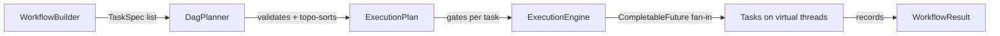

# AdaptiveFlow

[](https://github.com/Varun-51/AdaptiveFlow/actions/workflows/ci.yml)
[](https://adoptium.net/)
[](https://github.com/Varun-51/AdaptiveFlow/actions/workflows/ci.yml)
[](LICENSE)

Zero-runtime-dependency Java 21 library for executing task DAGs on **Virtual Threads**.

Build a workflow in one pass with a fluent API, let the engine validate it,
topologically sort it, and run it with one virtual thread per task — then read
the results out of an immutable, type-safe result object.

## Why

Workflow orchestration on the JVM usually means a heavy framework. AdaptiveFlow
is the opposite: a small, deliberate library (< 15 public types) built on what
Java 21 gives you for free — virtual threads, records, and `CompletableFuture`.
No Spring, no XML, no agent, no thread pools to babysit. The JVM handles the
carrier threads.

## Quick start

```java
import io.github.varun51.adaptiveflow.WorkflowBuilder;
import io.github.varun51.adaptiveflow.WorkflowResult;
import io.github.varun51.adaptiveflow.RetryPolicy;
import java.time.Duration;

WorkflowResult result = WorkflowBuilder.builder("etl")
        .task("extract", ctx -> fetchRows())                        // 1 h
        .task("validate", ctx -> validate(ctx.<Rows>result("extract")))
        .parallel(
                WorkflowBuilder.TaskRef.of("summary", ctx -> summarize(ctx.<Rows>result("extract"))),
                WorkflowBuilder.TaskRef.of("archives", ctx -> archive(ctx.<Rows>result("extract"))))
        .task("load", ctx -> load(ctx.<Summary>result("summary"), ctx.<Archive>result("archives")))
        .retry(RetryPolicy.exponentialBackoff(4, Duration.ofMillis(100)))
        .execute();                                                 // 2

if (result.isSuccess()) {
    Summary summary = result.<Summary>result("summary");
}
```

The two commented steps above are the mental model for the whole library:

1. **Describe**: tasks are chained; each task depends on everything added
   before it, `TaskRef`s inside a `parallel(...)` group run concurrently, and
   the next task after the group depends on all of them.
2. **Run**: `execute()` builds, validates, topologically sorts, and executes
   the DAG, then returns an immutable `WorkflowResult`.

That is the entire public API. Nothing else to learn.

## How it works



- **DagPlanner** validates the graph (duplicate ids, unknown dependencies,
  cycles via Kahn's algorithm) and freezes it into an immutable
  `ExecutionPlan`. Multi-root DAGs are allowed — that is how parallel
  entry-points are expressed.
- **ExecutionEngine** gives every task a `CompletableFuture` gate. A task is
  submitted to the executor once all its dependency gates complete; with
  one virtual thread per task, dependencies and independent branches align
  naturally with the machine's resources.
- **Retries** run inside the task's virtual thread: a failing task is
  re-invoked with the configured fixed or exponential backoff until it
  succeeds or its attempt budget is exhausted. Exponential waits get full
  jitter so synchronized failures do not collide on the same deadline.
- **Failure semantics**: when a task exhausts its retries the run stops
  dispatching downstream work, every still-pending task completes as
  `SKIPPED` (queryable through `taskResult(id)`), and
  `WorkflowResult.isSuccess()` is `false` with the error available on the
  failed task's `TaskResult`. Running siblings are not interrupted; they
  finish and report normally.
- **Context**: results live in a thread-safe `ExecutionContext` keyed by task
  id; `ctx.<T>result(id)` is type-checked at the call site. `WorkflowResult`
  takes an immutable snapshot once the run finishes.

## Retries

| Policy | Behaviour |
|---|---|
| `none()` | no retry (default) |
| `fixedDelay(attempts, delay)` | fixed pause between attempts |
| `exponentialBackoff(attempts, firstDelay, maxDelay)` | delay doubles per attempt, capped at `maxDelay` |

Failures before the attempt budget is spent never surface to the caller;
exhaustion surfaces the last error only.

## Executors

Virtual threads per task are the default. To supply your own backend:

```java
workflow.execute(Executors.newFixedThreadPool(4));
```

The caller-owned executor is never shut down by the library; `execute()`
(no argument) owns and closes its executor.

## Benchmarking

```shell
./mvnw -pl adaptiveflow-core test-compile exec:java \
  -Dexec.classpathScope=test \
  -Dexec.mainClass=org.openjdk.jmh.Main \
  -Dexec.args="-f 0 -wi 2 -i 3 -r 1"
```

Runs the JMH suite at `adaptiveflow-core/src/test/java/io/github/varun51/adaptiveflow/bench`.
`-f 0` runs in-process so the command works without a shaded benchmark jar;
use a fork count of 5 or more when you need CI-grade isolation.

Measured on this machine (Java 21, in-process, 3 iterations of 1 s):

| Benchmark            | Score     |
|----------------------|-----------|
| 5-task linear chain  | ~5.3k workflows/s |
| 10-task fan-in DAG   | ~6.5k workflows/s |

Operations are end-to-end: workflow construction, validation, planning,
execution, and result collection — virtual threads and all.

## Building from source

```shell
./mvnw -pl adaptiveflow-core verify
```

Runs the full quality gate: 51 unit tests (concurrency, retry, validation),
JaCoCo line/branch coverage thresholds (90 % / 80 %), a custom Checkstyle
ruleset, and SpotBugs at max effort.

## Requirements

Java 21 (Virtual Threads are a published feature; no preview flags).

## Not yet supported (deliberately out of v1.0)

- Task timeouts and workflow-wide timeouts
- Cancellation / interruption of a running workflow
- User-defined variables on the context (only task outputs are stored)
- Durable execution / checkpointing (see Temporal for that problem space)

## Roadmap

v1.0 keeps outcomes deterministic: the same workflow and inputs always
produce the same result. Where randomness is safe, the engine already adapts:
exponential retry waits get full jitter, so synchronized failures do not
pile onto the same backoff deadline. Adaptive scheduling (resource-aware,
learning from live executions) is the post-1.0 direction — the engine's
pluggable executor and per-task retry policies are the seams that direction
builds on.

## License

Apache License 2.0. See [LICENSE](LICENSE).